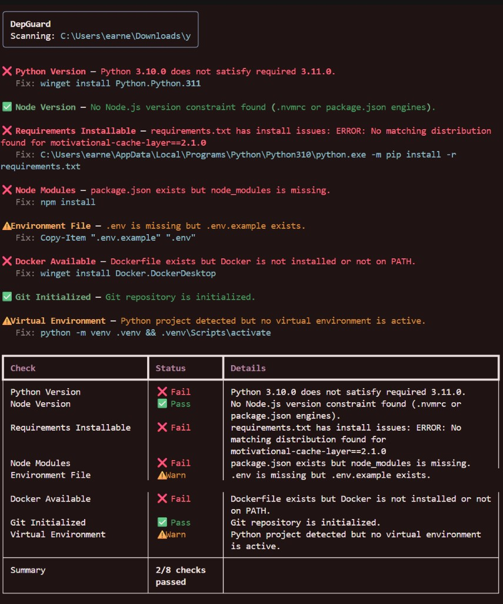

# DepGuard

**Scan any project folder. Diagnose setup problems. Get exact fix commands.**

DepGuard is a cross-platform Python CLI that inspects a local project and runs eight focused checks across Python, Node.js, Docker, Git, and environment configuration. Each issue comes with a copy-paste terminal command tailored to your operating system.

Works on **Windows, macOS, and Linux** — on any project with standard config files.

Repository: **[github.com/ernestkibz/DepGuard](https://github.com/ernestkibz/DepGuard)**

> **Setup guide:** See [setup.md](setup.md) for installing from GitHub, adding DepGuard to your project, CI, and Python API usage.

---

## Quick install

```bash
pip install "git+https://github.com/ernestkibz/DepGuard.git"
depguard /path/to/your/project
```

---

## Features

| Check | What it validates |
|-------|-------------------|
| Python Version | Matches `.python-version` or `pyproject.toml` `requires-python` |
| Node Version | Matches `.nvmrc` or `package.json` `engines.node` |
| Requirements | `requirements.txt` exists and packages are installable via pip dry-run |
| Node Modules | `package.json` present but `node_modules` missing |
| Environment File | `.env` missing while `.env.example` exists |
| Docker Available | `Dockerfile` present but Docker missing or daemon down |
| Git Initialized | `.git` directory exists |
| Virtual Environment | Python project detected but no active venv |

Output uses [Rich](https://github.com/Textualize/rich) for color-coded results:

- ✅ **Green** — check passed
- ❌ **Red** — check failed + exact fix command
- ⚠️ **Yellow** — warning + suggested command

Final score: **`X/8 checks passed`**

---

## Requirements

- Python 3.10 or newer
- pip

Optional (only when scanning projects that use them):

- Node.js — for Node version and `node_modules` checks
- Docker — when the target project contains a `Dockerfile`
- Git — for the Git initialized check

---

## Usage

```bash
depguard                  # scan current directory
depguard /path/to/project # scan any folder
depguard --version
```

After cloning the repo locally:

```bash
git clone https://github.com/ernestkibz/DepGuard.git
cd DepGuard
pip install -e .
depguard .
```

See [setup.md](setup.md) for Makefile scripts, `requirements-dev.txt`, GitHub Actions, and programmatic use.

### Example output

```
╭──────────────────────────────────────────────╮
│ DepGuard                                     │
│ Scanning: C:\projects\my-app                 │
╰──────────────────────────────────────────────╯

✅ Python Version — Python 3.11.8 satisfies required 3.11.0.
✅ Node Version — Node.js 20.11.0 satisfies required 20.0.0.
❌ Requirements Installable — requirements.txt has install issues: ...
   Fix: python -m pip install -r requirements.txt
❌ Node Modules — package.json exists but node_modules is missing.
   Fix: npm install
⚠️ Environment File — .env is missing but .env.example exists.
   Fix: Copy-Item ".env.example" ".env"
✅ Docker Available — No Dockerfile found — Docker not required.
❌ Git Initialized — Git is not initialized in this project folder.
   Fix: git init
⚠️ Virtual Environment — Python project detected but no virtual environment is active.
   Fix: python -m venv .venv && .venv\Scripts\activate

Final score: 4/8 checks passed
```

Exit code is `0` when all 8 checks pass, `1` otherwise.

---

## Screenshots



---

## Project structure

```
DepGuard/
├── depguard.py            # CLI entry point
├── checks/
│   ├── __init__.py        # Check registry and version
│   ├── base.py            # Shared types, OS helpers, fix commands
│   ├── python_version.py
│   ├── node_version.py
│   ├── requirements.py
│   ├── node_modules.py
│   ├── env_file.py
│   ├── docker.py
│   ├── git_init.py
│   └── venv_active.py
├── pyproject.toml         # Package metadata and depguard console script
├── setup.md               # Install from GitHub, CI, project integration
├── requirements.txt
├── LICENSE
└── README.md
```

---

## Architecture

```
depguard.py
    └── checks.ALL_CHECKS  (registry: display name → check_fn)
            └── check_*(project: Path) → CheckResult
                    └── checks.base helpers (encoding, OS detection, fix commands)
```

Design principles:

- **Registry pattern** — add a check function and register it in `ALL_CHECKS`
- **Pure check functions** — each takes a `Path`, returns a `CheckResult`; no side effects
- **Centralized platform logic** — fix commands live in `checks/base.py` so every check stays consistent across OSes
- **Graceful degradation** — missing config files pass with an informational message
- **UTF-8 everywhere** — Windows console is reconfigured on startup; file reads try multiple encodings

---

## Extending

Add a new check in `checks/`:

```python
from pathlib import Path
from checks.base import CheckResult, Status

def check_my_thing(project: Path) -> CheckResult:
    return CheckResult(
        name="My Check",
        status=Status.PASS,
        message="Everything looks good.",
    )
```

Register it in `checks/__init__.py` inside `ALL_CHECKS`.

---

## License

MIT — see [LICENSE](LICENSE).
